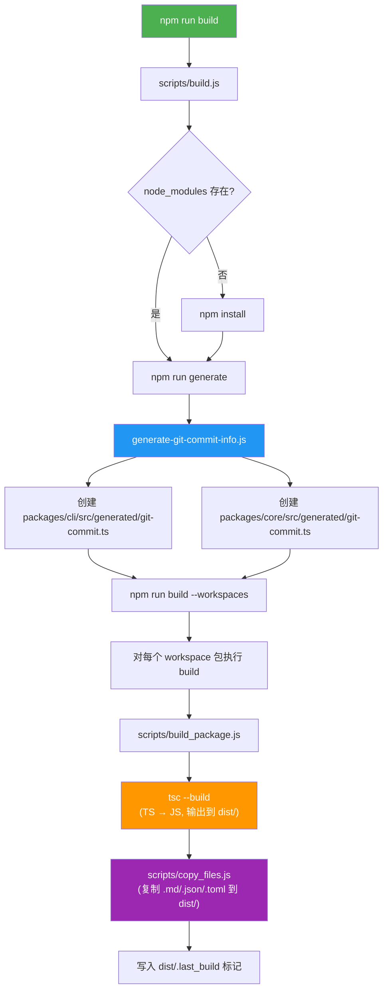
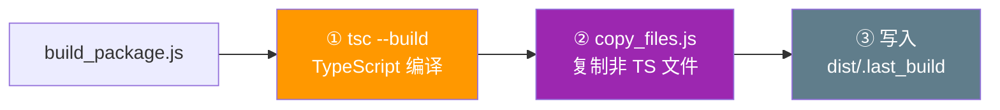
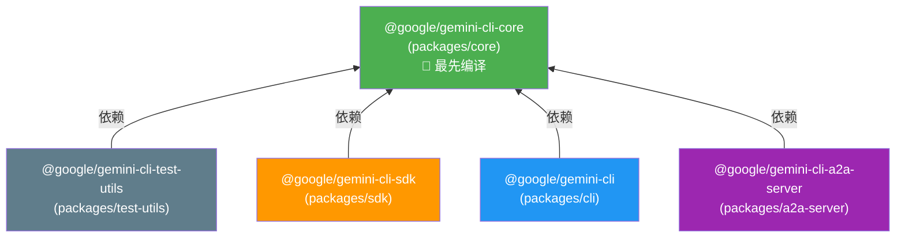
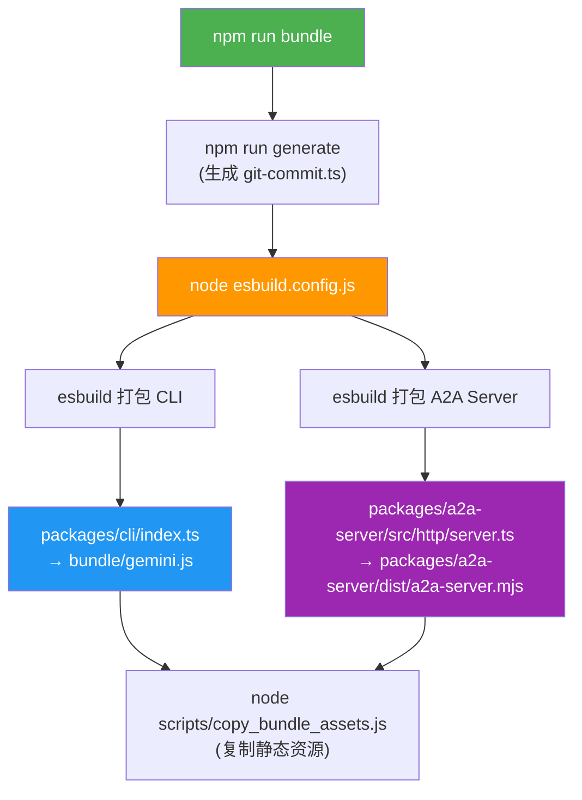
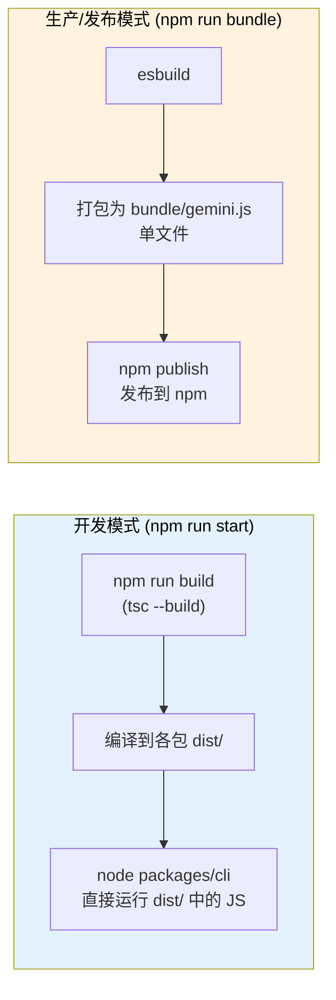
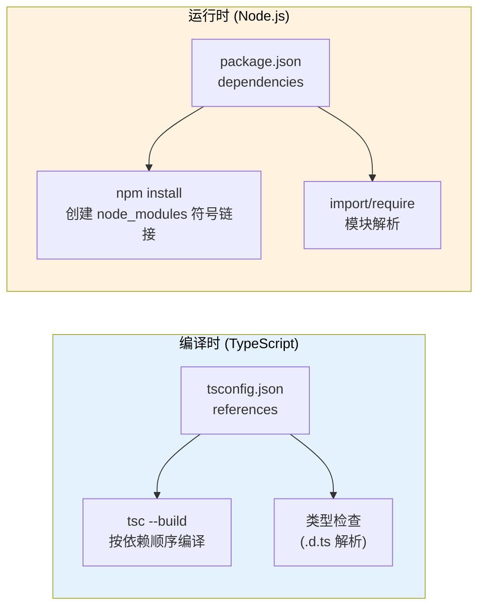

# Gemini CLI 构建流程详解

本文档详细分析了 Gemini CLI 项目的编译和构建流程，包括 TypeScript 编译、包依赖管理以及发布打包等环节。

---

## 整体架构

项目使用 **npm workspaces** 管理多个包，在根 `package.json` 中定义：

```json
"workspaces": ["packages/*"]
```

`packages/` 目录下包含以下子包：

| 包名 | 目录 | 说明 |
|------|------|------|
| `@google/gemini-cli-core` | `packages/core` | 核心后端逻辑 |
| `@google/gemini-cli` | `packages/cli` | 命令行界面 |
| `@google/gemini-cli-sdk` | `packages/sdk` | SDK |
| `@google/gemini-cli-a2a-server` | `packages/a2a-server` | A2A 服务器 |
| `@google/gemini-cli-test-utils` | `packages/test-utils` | 测试工具 |
| vscode-ide-companion | `packages/vscode-ide-companion` | VS Code 扩展 |

---

## 为什么 `package.json` 中的构建脚本使用 `.js` 文件？

项目中存在两种脚本类型：

### 1. 纯 JavaScript 脚本（`.js` 文件）

`scripts/` 目录下的构建和工具脚本**直接编写为 JavaScript**，不需要编译。例如：

- `scripts/build.js` — 主构建脚本
- `scripts/build_package.js` — 各包构建脚本
- `scripts/build_sandbox.js` — 沙箱构建
- `scripts/clean.js` — 清理脚本

这些脚本在 `package.json` 中通过 `node` 命令直接运行。之所以用 `.js` 是为了**避免"鸡生蛋"问题**——构建工具本身不应该依赖编译流程。

### 2. TypeScript 脚本（`.ts` 文件）

某些脚本使用 TypeScript 编写，通过 `tsx` 工具**即时编译和运行**，无需预编译：

```json
"schema:settings": "tsx ./scripts/generate-settings-schema.ts",
"docs:settings": "tsx ./scripts/generate-settings-doc.ts",
"docs:keybindings": "tsx ./scripts/generate-keybindings-doc.ts"
```

### 3. 应用源代码（`packages/` 中的 `.ts` 文件）

项目的主要源代码用 TypeScript 编写，通过 `tsc`（TypeScript 编译器）编译为 JavaScript，输出到各包的 `dist/` 目录。

---

## 构建流程总览



---

## 详细步骤解析

### 步骤 1：`npm run build` — 入口

执行 `npm run build` 时调用 `scripts/build.js`，它完成以下操作：

1. 检查 `node_modules` 是否存在，不存在则运行 `npm install`
2. 运行 `npm run generate` → 调用 `scripts/generate-git-commit-info.js`
3. 运行 `npm run build --workspaces` → 对每个 workspace 包执行各自的 `build` 脚本

### 步骤 2：`npm run generate` — 生成代码

`scripts/generate-git-commit-info.js` 做了以下事情：

1. 创建 `packages/cli/src/generated/` 和 `packages/core/src/generated/` 目录（如果不存在）
2. 获取当前 Git commit 的短 hash
3. 读取 `package.json` 中的版本号
4. 生成 `git-commit.ts` 文件，内容类似：

```typescript
export const GIT_COMMIT_INFO = 'abc1234';
export const CLI_VERSION = '0.30.0-nightly.20260210.a2174751d';
```

> **注意**：`generated/` 目录被列在 `.gitignore` 中，不会被提交到 Git 仓库。克隆仓库后需要执行构建才能生成这些文件。`.gitignore` 中相关配置：
>
> ```gitignore
> # Generated files
> packages/cli/src/generated/
> packages/core/src/generated/
> ```

### 步骤 3：`build_package.js` — 每个包的编译

所有包的 `build` 脚本都指向同一个文件 `scripts/build_package.js`，它执行三步操作：



#### 3.1 TypeScript 编译

```js
execSync('tsc --build', { stdio: 'inherit' });
```

调用 TypeScript 编译器的 **project build 模式**（`--build`），这会：

- 读取各包的 `tsconfig.json`（继承根目录的 `tsconfig.json`）
- 将 `.ts` 文件编译为 `.js` 文件，输出到 `dist/` 目录
- 同时生成 `.d.ts` 类型声明文件和 `.js.map` source map 文件

#### 3.2 复制非 TypeScript 文件

```js
execSync('node ../../scripts/copy_files.js', { stdio: 'inherit' });
```

将 `src/` 中的 `.md`、`.json`、`.sb`、`.toml` 等非 TypeScript 文件复制到 `dist/src/` 目录。对于特定包还会额外复制：

- **cli 包**：复制 extensions 的 examples 目录
- **core 包**：复制 built-in skills 和 `docs/` 目录

#### 3.3 写入构建标记

```js
writeFileSync(join(process.cwd(), 'dist', '.last_build'), '');
```

---

## 包依赖关系与编译顺序



依赖关系通过两种方式定义：

1. **`package.json` 的 `dependencies`**：如 `"@google/gemini-cli-core": "file:../core"`
2. **`tsconfig.json` 的 `references`**：如 `"references": [{ "path": "../core" }]`

`tsc --build` 模式会自动根据 `references` 解析依赖顺序，确保 `core` 先于其他包编译。

---

## TypeScript 编译配置

每个包的 `tsconfig.json` 都继承根目录的 `tsconfig.json`，关键配置如下：

| 配置项 | 值 | 说明 |
|--------|------|------|
| `outDir` | `"dist"` | 编译输出目录 |
| `module` | `"NodeNext"` | 使用 Node.js ESM 模块系统 |
| `target` | `"es2022"` | 编译目标为 ES2022 |
| `sourceMap` | `true` | 生成 source map |
| `declaration` | `true` | 生成 `.d.ts` 类型声明 |
| `composite` | `true` | 启用项目引用（project references） |
| `incremental` | `true` | 增量编译 |
| `strict` | `true` | 严格类型检查 |

---

## 发布用的 Bundle 过程

除了 `tsc` 编译外，项目还有基于 **esbuild** 的打包流程，用于生成发布用的单文件。



### esbuild 打包特点

- **直接读取 `.ts` 源文件**：esbuild 无需先通过 `tsc` 编译，效率极高
- **生成单文件**：将整个项目及其依赖打包为一个 `.js` 文件
- **原生 Node 模块标记为 external**：如 `node-pty`、`keytar` 等不会被打包

最终发布的 npm 包使用 `bundle/gemini.js` 这个打包后的单文件（在根 `package.json` 中：`"bin": { "gemini": "bundle/gemini.js" }`）。

---

## 开发与生产构建对比



| 对比项 | 开发模式 | 生产模式 |
|--------|----------|----------|
| 编译工具 | `tsc` | `esbuild` |
| 输出方式 | 多文件（`dist/` 目录） | 单文件（`bundle/gemini.js`） |
| 输出位置 | 各包的 `dist/` | 根目录 `bundle/` |
| 是否需要 `node_modules` | 是 | 否（依赖已打包） |
| 用途 | 本地开发调试 | npm 发布和分发 |

---

## 被 `.gitignore` 排除的构建产物

以下目录/文件都是构建时动态产生的，不会被提交到 Git 仓库：

| 路径 | 说明 |
|------|------|
| `dist/` | 各包的 TypeScript 编译输出 |
| `bundle/` | esbuild 打包输出 |
| `packages/cli/src/generated/` | 自动生成的 git commit 信息 |
| `packages/core/src/generated/` | 自动生成的 git commit 信息 |
| `*.tsbuildinfo` | TypeScript 增量编译信息 |

---

## Q&A

### Q: `tsconfig.json` 的 `references` 和 `package.json` 的 `dependencies` 都声明了对 `core` 的依赖，是否重复？

以 `packages/sdk` 为例，`tsconfig.json` 中有：

```json
"references": [{ "path": "../core" }]
```

`package.json` 中也有：

```json
"dependencies": {
  "@google/gemini-cli-core": "file:../core"
}
```

**答案是：两者都有必要，因为它们服务于不同层面。**



具体区别如下：

| 特性 | `tsconfig.json` 的 `references` | `package.json` 的 `dependencies` |
|------|------|------|
| **作用层面** | TypeScript 编译器（编译时） | npm / Node.js（安装时和运行时） |
| **主要功能** | 确定项目编译顺序；启用增量编译；引用其他项目的类型声明 | 安装依赖包；在 `node_modules` 中创建符号链接 |
| **影响的工具** | `tsc --build` | `npm install`、`node` 运行时 |
| **缺少会怎样** | `tsc --build` 不知道要先编译 `core`；类型检查可能失败 | Node.js 运行时找不到 `@google/gemini-cli-core` 模块；`import` 语句报错 |

**举个例子说明为何两者缺一不可：**

1. **只有 `tsconfig.json references`，没有 `package.json dependencies`**：
   - `tsc --build` 能正常编译（知道先编译 core）
   - 但 `npm install` 不会在 `node_modules` 中创建 `@google/gemini-cli-core` 的符号链接
   - 运行时 `import { ... } from '@google/gemini-cli-core'` 会报 `MODULE_NOT_FOUND` 错误

2. **只有 `package.json dependencies`，没有 `tsconfig.json references`**：
   - `npm install` 正常工作，`node_modules` 中有正确的符号链接
   - 但 `tsc --build` 不知道需要先编译 core，可能导致编译顺序错误
   - 如果 core 还没编译（没有 `dist/` 目录），sdk 的编译会因为找不到类型声明而失败

**总结**：`references` 解决的是**编译时**的依赖和类型解析问题，`dependencies` 解决的是**运行时**的模块查找问题。在 TypeScript monorepo 项目中，两者需要同时声明才能保证编译和运行都正常工作。

---

### Q: `tsconfig.json` 中 `src/**/*.ts` 的 `**` 是否包含 `src/` 直接子文件？

以 `packages/core/tsconfig.json` 为例：

```json
"include": ["index.ts", "src/**/*.ts", "src/**/*.json"]
```

**答案是：`src/**/*.ts` 匹配 `src/` 下任意深度的 `.ts` 文件，包括直接位于 `src/` 下的文件。**

`**` 是 globstar 模式，匹配**零个或多个**目录层级。所以 `src/**/*.ts` 等价于匹配以下所有情况：

| 模式 | 匹配的 `**` 层级 | 示例 |
|------|------|------|
| `src/*.ts` | 零层（直接子文件） | `src/index.ts` |
| `src/*/*.ts` | 一层 | `src/tools/shell.ts` |
| `src/*/*/*.ts` | 二层 | `src/tools/shell/execute.ts` |
| `src/*/*/*/*.ts` | 三层 | `src/tools/shell/utils/parser.ts` |
| ... | 任意层 | ... |

**关键点**：`**` 匹配的是**零个或多个**目录，不是"一个或多个"。所以：

- `src/**/*.ts` — ✅ 匹配 `src/foo.ts`（零层子目录）
- `src/**/*.ts` — ✅ 匹配 `src/a/foo.ts`（一层子目录）
- `src/**/*.ts` — ✅ 匹配 `src/a/b/c/foo.ts`（多层子目录）

这与某些人的直觉不同——有人可能以为 `**` 至少匹配一层目录，但实际上它可以匹配零层，因此 `src/**/*.ts` 已经完全覆盖了 `src/*.ts` 的范围，无需额外再写 `src/*.ts`。

> **注意**：`include` 中还单独列出了 `"index.ts"`，这是因为 `index.ts` 位于包的根目录（如 `packages/core/index.ts`），不在 `src/` 目录下，所以 `src/**/*.ts` 无法匹配到它，需要单独声明。