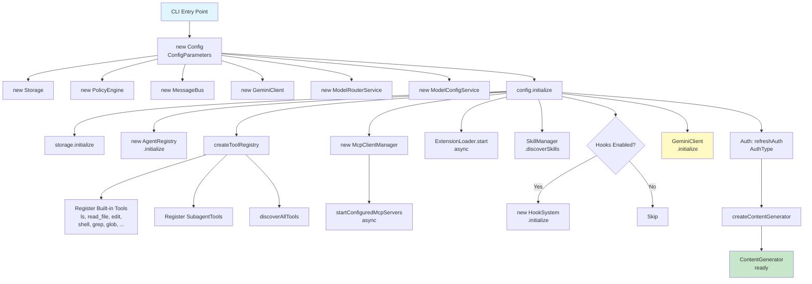
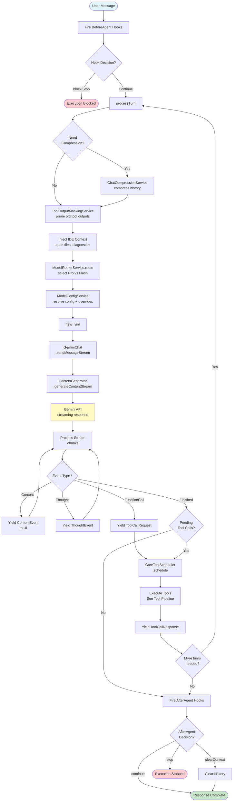
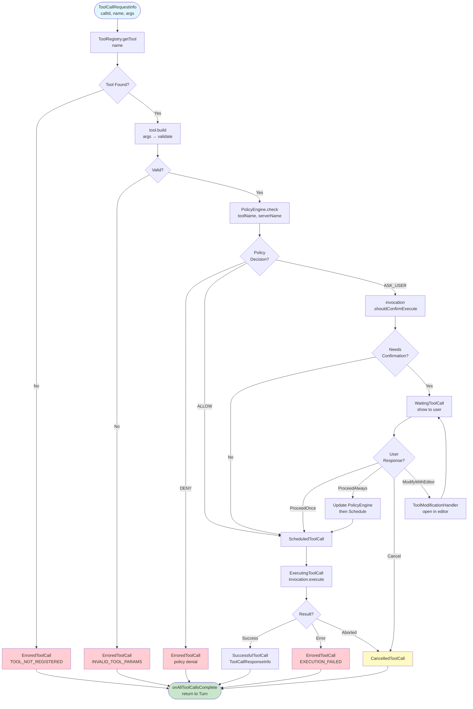
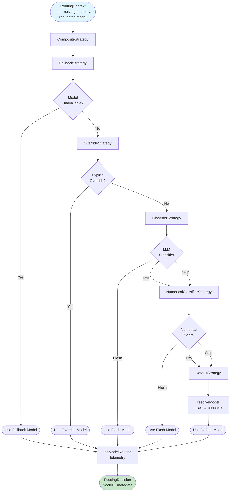
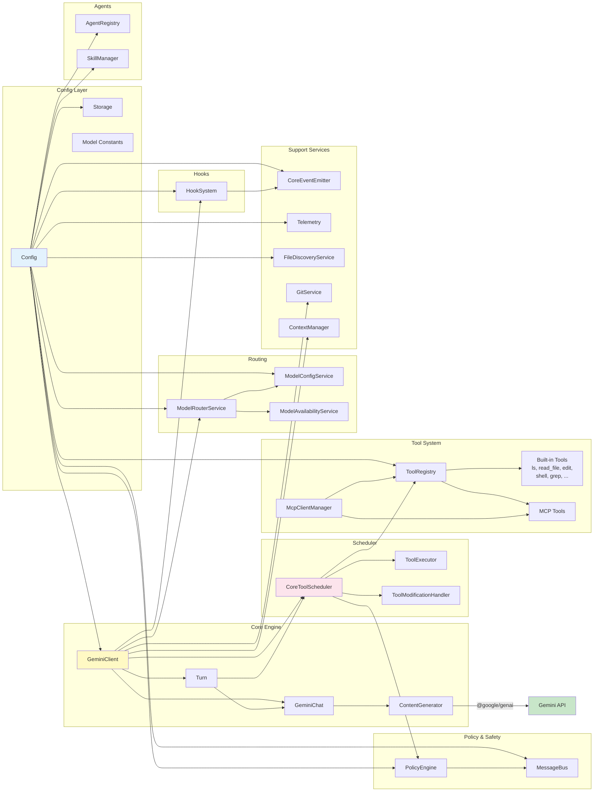

# Gemini CLI Core (`packages/core`) — Architecture Documentation

> Auto-generated deep-dive into the `packages/core` package of **gemini-cli**.
> Covers key variables & types, inter-module call relationships, data-flow semantics, and Mermaid workflow charts.

---

## Table of Contents

1. [Project Overview](#1-project-overview)
2. [Directory Structure](#2-directory-structure)
3. [Core Variables & Types](#3-core-variables--types)
   - 3.1 [Config Layer](#31-config-layer)
   - 3.2 [Core Engine Layer](#32-core-engine-layer)
   - 3.3 [Tool System Layer](#33-tool-system-layer)
   - 3.4 [Scheduler Layer](#34-scheduler-layer)
   - 3.5 [Hook System Layer](#35-hook-system-layer)
   - 3.6 [Agent System Layer](#36-agent-system-layer)
   - 3.7 [Policy & Safety Layer](#37-policy--safety-layer)
   - 3.8 [Routing Layer](#38-routing-layer)
   - 3.9 [Telemetry Layer](#39-telemetry-layer)
   - 3.10 [Event System Layer](#310-event-system-layer)
   - 3.11 [Storage Layer](#311-storage-layer)
   - 3.12 [Model Constants](#312-model-constants)
4. [Call Relationships](#4-call-relationships)
   - 4.1 [Initialization Flow](#41-initialization-flow)
   - 4.2 [Message Processing Flow](#42-message-processing-flow)
   - 4.3 [Tool Execution Flow](#43-tool-execution-flow)
   - 4.4 [Model Routing Flow](#44-model-routing-flow)
5. [Data Flow During Calls](#5-data-flow-during-calls)
   - 5.1 [User Message → LLM Response](#51-user-message--llm-response)
   - 5.2 [Tool Call Lifecycle](#52-tool-call-lifecycle)
   - 5.3 [Compression & Token Management](#53-compression--token-management)
6. [Mermaid Workflow Charts](#6-mermaid-workflow-charts)
   - 6.1 [System Initialization](#61-system-initialization)
   - 6.2 [Agentic Loop (Main Data Flow)](#62-agentic-loop-main-data-flow)
   - 6.3 [Tool Execution Pipeline](#63-tool-execution-pipeline)
   - 6.4 [Model Routing Decision](#64-model-routing-decision)
   - 6.5 [Component Dependency Graph](#65-component-dependency-graph)

---

## 1. Project Overview

`packages/core` is the heart of the Gemini CLI. It is published as `@google/gemini-cli-core` and provides:

- **LLM Client Abstraction** — wraps the `@google/genai` SDK to manage chat sessions, streaming, retries, and compression.
- **Agentic Tool Loop** — an iterative loop where the model can call tools (file I/O, shell, web fetch, MCP servers, etc.), receive results, and call more tools until the task is complete.
- **Configuration Management** — a `Config` god-object that wires together all services: tools, MCP, hooks, policies, telemetry, model routing, and storage.
- **Hook System** — lifecycle hooks (`BeforeAgent`, `AfterAgent`, `BeforeModel`, `AfterModel`, `BeforeTool`, `AfterTool`, etc.) that allow extensions to intercept, modify, or block operations.
- **Policy Engine** — a rule-based engine that decides whether tool calls should be allowed, denied, or require user confirmation.
- **Model Routing** — an intelligent composite strategy that selects the optimal model (Pro vs Flash) per request.
- **Telemetry** — OpenTelemetry-based metrics, traces, and logs.

### Key External Dependencies

| Dependency | Purpose |
|---|---|
| `@google/genai` | Google Generative AI SDK (content generation, streaming, function calling) |
| `@modelcontextprotocol/sdk` | MCP server/client protocol |
| `@opentelemetry/*` | Telemetry (metrics, traces, logs) |
| `simple-git` | Git operations for checkpointing |
| `web-tree-sitter` | Code parsing |
| `zod` | Schema validation for agents |

---

## 2. Directory Structure

```
packages/core/src/
├── agents/           # Agent definitions, registry, subagent tool, A2A protocol
├── availability/     # Model availability checking
├── code_assist/      # Code Assist API integration, experiments, admin controls
├── commands/         # Slash command infrastructure
├── config/           # Config class, model constants, storage, memory, defaults
├── confirmation-bus/ # Message bus for tool confirmation (pub/sub)
├── core/             # GeminiClient, GeminiChat, Turn, ContentGenerator, scheduler
├── fallback/         # Fallback model handler types
├── hooks/            # Hook system (BeforeAgent, AfterAgent, BeforeModel, etc.)
├── ide/              # IDE context detection & integration
├── mcp/              # MCP OAuth provider
├── mocks/            # Test mocks
├── output/           # Output format types
├── policy/           # Policy engine (allow/deny/ask_user), approval modes
├── prompts/          # Prompt registry, system prompt generation
├── resources/        # Resource registry
├── routing/          # Model router service & strategies
├── safety/           # Safety checker protocol
├── scheduler/        # Tool executor, modifier, policy helpers
├── services/         # FileDiscovery, Git, ModelConfig, ContextManager, etc.
├── skills/           # Skill manager & definitions
├── telemetry/        # OTel SDK init, loggers, metrics, traces, activity monitor
├── test-utils/       # Test utilities
├── tools/            # Tool definitions (ls, read-file, edit, shell, grep, etc.)
└── utils/            # Events, debug logger, paths, fetch, editor, etc.
```

---

## 3. Core Variables & Types

### 3.1 Config Layer

#### `Config` class (`config/config.ts`)

The central god-object that holds all configuration and service references.

| Field | Type | Description |
|---|---|---|
| `sessionId` | `string` | Unique session identifier |
| `clientVersion` | `string` | CLI client version string |
| `model` | `string` | Requested model name (may be alias like `"auto"`) |
| `_activeModel` | `string` | Currently resolved concrete model name |
| `targetDir` | `string` | Workspace root directory |
| `cwd` | `string` | Current working directory |
| `debugMode` | `boolean` | Whether debug mode is enabled |
| `interactive` | `boolean` | Whether running in interactive (TTY) mode |
| `contentGenerator` | `ContentGenerator` | LLM API abstraction |
| `contentGeneratorConfig` | `ContentGeneratorConfig` | Auth & API configuration |
| `geminiClient` | `GeminiClient` | Main chat orchestrator |
| `baseLlmClient` | `BaseLlmClient` | Stateless LLM client for routing/classification |
| `toolRegistry` | `ToolRegistry` | Registry of all available tools |
| `promptRegistry` | `PromptRegistry` | Registry of prompts |
| `resourceRegistry` | `ResourceRegistry` | Registry of resources |
| `agentRegistry` | `AgentRegistry` | Registry of agent definitions |
| `skillManager` | `SkillManager` | Manages skill discovery and activation |
| `mcpClientManager` | `McpClientManager` | MCP server connection manager |
| `modelRouterService` | `ModelRouterService` | Intelligent model selection |
| `modelAvailabilityService` | `ModelAvailabilityService` | Tracks which models are available |
| `modelConfigService` | `ModelConfigService` | Resolves model config aliases & overrides |
| `policyEngine` | `PolicyEngine` | Tool execution policy (allow/deny/ask) |
| `messageBus` | `MessageBus` | Pub/sub for tool confirmation messages |
| `hookSystem` | `HookSystem \| undefined` | Lifecycle hook execution system |
| `storage` | `Storage` | File system storage paths management |
| `fileDiscoveryService` | `FileDiscoveryService \| null` | File discovery with gitignore awareness |
| `gitService` | `GitService \| undefined` | Git operations for checkpointing |
| `workspaceContext` | `WorkspaceContext` | Manages allowed workspace directories |
| `fileExclusions` | `FileExclusions` | File ignore pattern management |
| `contextManager` | `ContextManager \| undefined` | JIT context management |
| `experiments` | `Experiments \| undefined` | Remote experiment flags |
| `userMemory` | `string \| HierarchicalMemory` | User memory from GEMINI.md files |
| `mcpServers` | `Record<string, MCPServerConfig> \| undefined` | MCP server configurations |
| `toolOutputMasking` | `ToolOutputMaskingConfig` | Tool output pruning configuration |
| `telemetrySettings` | `TelemetrySettings` | Telemetry configuration |
| `fallbackModelHandler` | `FallbackModelHandler \| undefined` | Handles model fallback on errors |
| `validationHandler` | `ValidationHandler \| undefined` | Content validation handler |
| `hooks` | `{ [K in HookEventName]?: HookDefinition[] }` | User-level hook definitions |
| `projectHooks` | `{ [K in HookEventName]?: HookDefinition[] }` | Project-level hook definitions |

#### `ConfigParameters` interface (`config/config.ts`)

The input to the `Config` constructor — over 90 optional/required fields covering every aspect of CLI behavior.

Key fields include:
- `sessionId: string`, `targetDir: string`, `cwd: string`, `model: string`
- `mcpServers`, `approvalMode`, `telemetry`, `fileFiltering`
- `enableHooks`, `enableAgents`, `skillsSupport`, `plan`
- `toolOutputMasking`, `policyEngineConfig`, `shellExecutionConfig`

#### `MCPServerConfig` class (`config/config.ts`)

```typescript
class MCPServerConfig {
  command?: string;       // stdio transport command
  args?: string[];        // stdio transport args
  env?: Record<string, string>;
  url?: string;           // SSE/HTTP transport URL
  httpUrl?: string;       // Streamable HTTP URL (deprecated)
  tcp?: string;           // WebSocket transport
  type?: 'sse' | 'http';  // Transport type hint
  timeout?: number;
  trust?: boolean;
  oauth?: MCPOAuthConfig;
  // ... more fields
}
```

#### `AuthProviderType` enum

```typescript
enum AuthProviderType {
  DYNAMIC_DISCOVERY = 'dynamic_discovery',
  GOOGLE_CREDENTIALS = 'google_credentials',
  SERVICE_ACCOUNT_IMPERSONATION = 'service_account_impersonation',
}
```

---

### 3.2 Core Engine Layer

#### `GeminiClient` class (`core/client.ts`)

The main orchestrator that manages the agentic loop.

| Field | Type | Description |
|---|---|---|
| `chat` | `GeminiChat` | Current chat session managing conversation history |
| `config` | `Config` | Reference to the global config |
| `loopDetector` | `LoopDetectionService` | Detects infinite tool-call loops |
| `compressionService` | `ChatCompressionService` | Compresses chat history when token limit approaches |
| `toolOutputMaskingService` | `ToolOutputMaskingService` | Prunes old tool outputs to save tokens |
| `hookStateMap` | `Map` | Tracks hook state for stop/block logic |
| `currentSequenceModel` | `string \| undefined` | Model used for current agentic sequence |
| `sessionTurnCount` | `number` | Number of user turns in this session |

Key methods:

| Method | Signature | Description |
|---|---|---|
| `sendMessageStream()` | `(request, signal) => AsyncGenerator<ServerGeminiStreamEvent>` | Entry point — fires BeforeAgent hook, delegates to `processTurn()` |
| `processTurn()` | `(request, signal, ...) => AsyncGenerator<ServerGeminiStreamEvent>` | Handles compression, token limits, IDE context injection, model routing, runs `Turn` |
| `generateContent()` | `(request, model?) => Promise<GenerateContentResponse>` | Non-streaming generation with retry |
| `startChat()` | `(systemPrompt, tools, history?) => void` | Creates new `GeminiChat` with system prompt and tools |
| `setTools()` | `() => Promise<void>` | Updates the tool set on the current chat session |
| `updateSystemInstruction()` | `() => void` | Refreshes system instruction with latest memory |
| `stripThoughtsFromHistory()` | `() => void` | Removes thought signatures when switching auth types |

#### `GeminiChat` class (`core/geminiChat.ts`)

Manages conversation history and streaming API calls.

| Field | Type | Description |
|---|---|---|
| `history` | `Content[]` | Conversation message history |
| `contentGenerator` | `ContentGenerator` | LLM API abstraction |
| `systemInstruction` | `Content` | System prompt |
| `tools` | `ToolListUnion` | Available function declarations |
| `toolConfig` | `ToolConfig` | Tool selection configuration |
| `config` | `Config` | Global config reference |
| `chatRecordingService` | `ChatRecordingService` | Records conversations for debugging |
| `invalidStreamRetryCount` | `number` | Retry counter for invalid streams |

Key methods:

| Method | Description |
|---|---|
| `sendMessageStream(request, signal)` | Sends message and returns async generator of `StreamEvent` |
| `processStreamResponse(stream)` | Validates, consolidates stream parts, records response |
| `makeApiCallAndProcessStream()` | Core API call + retry logic for `InvalidStreamError` |

#### `ContentGenerator` interface (`core/contentGenerator.ts`)

Abstracts the LLM API behind a common interface.

```typescript
interface ContentGenerator {
  generateContent(params): Promise<GenerateContentResponse>;
  generateContentStream(params): Promise<AsyncGenerator<GenerateContentResponse>>;
  countTokens(params): Promise<CountTokensResponse>;
  embedContent(params): Promise<EmbedContentResponse>;
  userTier?: UserTierId;
  userTierName?: string;
}
```

Factory function `createContentGenerator()` creates the implementation based on `AuthType`:

```typescript
enum AuthType {
  LOGIN_WITH_GOOGLE = 'LOGIN_WITH_GOOGLE',
  USE_GEMINI = 'USE_GEMINI',
  USE_VERTEX_AI = 'USE_VERTEX_AI',
  LEGACY_CLOUD_SHELL = 'LEGACY_CLOUD_SHELL',
  COMPUTE_ADC = 'COMPUTE_ADC',
}
```

#### `Turn` class (`core/turn.ts`)

Represents a single agentic loop turn (one LLM call + tool execution cycle).

| Field | Type | Description |
|---|---|---|
| `pendingToolCalls` | `ToolCallRequestInfo[]` | Tool calls waiting to be executed |
| `config` | `Config` | Global config |
| `chat` | `GeminiChat` | Chat session |

Key method:

```typescript
async *run(request, signal): AsyncGenerator<ServerGeminiStreamEvent>
```

Yields events of type `ServerGeminiStreamEvent` — a union of:

```typescript
type ServerGeminiStreamEvent =
  | ContentEvent       // Text/response content chunk
  | ToolCallRequest    // Model requests a tool call
  | ToolCallResponse   // Tool execution result
  | ThoughtEvent       // Model thinking/reasoning
  | ErrorEvent         // Error occurred
  | FinishedEvent      // Turn completed
  | AgentExecutionStopped   // Hook stopped execution
  | AgentExecutionBlocked   // Hook blocked execution
  // ... ~17 event types total
```

#### `GeminiCodeRequest` type (`core/geminiRequest.ts`)

```typescript
type GeminiCodeRequest = PartListUnion;  // from @google/genai
```

#### `CompressionStatus` enum

```typescript
enum CompressionStatus {
  COMPRESSED = 'COMPRESSED',
  COMPRESSION_FAILED_INFLATED_TOKEN_COUNT = '...',
  // ... other statuses
}
```

---

### 3.3 Tool System Layer

#### `DeclarativeTool<TParams, TResult>` class (`tools/tools.ts`)

Base class for all tools. Separates validation from execution.

| Field | Type | Description |
|---|---|---|
| `name` | `string` | Internal tool name (used for API calls) |
| `displayName` | `string` | User-friendly display name |
| `description` | `string` | Tool description |
| `kind` | `Kind` | Tool category for permissions |
| `parameterSchema` | `unknown` | JSON schema for parameters |
| `messageBus` | `MessageBus` | Confirmation message bus |
| `isOutputMarkdown` | `boolean` | Whether output renders as markdown |
| `canUpdateOutput` | `boolean` | Whether tool supports streaming output |

```typescript
enum Kind {
  Read = 'read', Edit = 'edit', Delete = 'delete', Move = 'move',
  Search = 'search', Execute = 'execute', Think = 'think',
  Fetch = 'fetch', Communicate = 'communicate', Plan = 'plan', Other = 'other',
}
```

#### `ToolInvocation<TParams, TResult>` interface

A validated and ready-to-execute tool call:

```typescript
interface ToolInvocation<TParams, TResult> {
  params: TParams;
  getDescription(): string;
  toolLocations(): ToolLocation[];
  shouldConfirmExecute(signal): Promise<ToolCallConfirmationDetails | false>;
  execute(signal, updateOutput?, shellConfig?): Promise<TResult>;
}
```

#### `ToolResult` interface

```typescript
interface ToolResult {
  llmContent: PartListUnion;           // Content for LLM history
  returnDisplay: ToolResultDisplay;     // User-facing display
  error?: { message: string; type?: ToolErrorType };
  data?: Record<string, unknown>;
}
```

#### `ToolCallConfirmationDetails` (union type)

```typescript
type ToolCallConfirmationDetails =
  | ToolEditConfirmationDetails     // File edit with diff
  | ToolExecuteConfirmationDetails  // Shell command execution
  | ToolMcpConfirmationDetails      // MCP tool call
  | ToolInfoConfirmationDetails     // Generic info confirmation
  | ToolAskUserConfirmationDetails  // Ask user questions
  | ToolExitPlanModeConfirmationDetails;
```

#### `ToolConfirmationOutcome` enum

```typescript
enum ToolConfirmationOutcome {
  ProceedOnce = 'proceed_once',
  ProceedAlways = 'proceed_always',
  ProceedAlwaysAndSave = 'proceed_always_and_save',
  ProceedAlwaysServer = 'proceed_always_server',
  ProceedAlwaysTool = 'proceed_always_tool',
  ModifyWithEditor = 'modify_with_editor',
  Cancel = 'cancel',
}
```

#### Built-in Tools

| Tool Class | Name | Kind | Description |
|---|---|---|---|
| `LSTool` | `ls` | Read | List directory contents |
| `ReadFileTool` | `read_file` | Read | Read file contents |
| `GrepTool` | `grep_search` | Search | Search file contents |
| `RipGrepTool` | `grep_search` | Search | Fast search using ripgrep |
| `GlobTool` | `glob` | Search | Find files by glob pattern |
| `EditTool` | `edit` | Edit | Edit file contents (diff-based) |
| `WriteFileTool` | `write_file` | Edit | Write/create files |
| `ShellTool` | `shell` | Execute | Execute shell commands |
| `WebFetchTool` | `web_fetch` | Fetch | Fetch web URLs |
| `WebSearchTool` | `web_search` | Fetch | Search the web |
| `MemoryTool` | `save_memory` | Edit | Save to GEMINI.md files |
| `AskUserTool` | `ask_user` | Communicate | Ask user for input |
| `WriteTodosTool` | `write_todos` | Edit | Write todo lists |
| `ActivateSkillTool` | `activate_skill` | Other | Activate a skill |
| `EnterPlanModeTool` | `enter_plan_mode` | Plan | Switch to plan mode |
| `ExitPlanModeTool` | `exit_plan_mode` | Plan | Exit plan mode |
| `SubagentTool` | (dynamic) | Other | Invoke a subagent |

#### `ToolRegistry` class (`tools/tool-registry.ts`)

| Field | Type | Description |
|---|---|---|
| `allKnownTools` | `Map<string, AnyDeclarativeTool>` | All registered tools (keyed by name) |
| `config` | `Config` | Global config reference |
| `messageBus` | `MessageBus` | Confirmation bus |

Key methods:
- `registerTool(tool)` — adds a tool to the registry
- `unregisterTool(name)` — removes a tool
- `getTool(name)` — looks up by name (supports aliases)
- `getFunctionDeclarations(modelId?)` — returns active tool schemas for the LLM
- `getAllTools()` — returns all non-excluded tools
- `discoverAllTools()` — discovers tools from command-line and MCP
- `sortTools()` — sorts: built-in → discovered → MCP (by server name)

---

### 3.4 Scheduler Layer

#### `CoreToolScheduler` class (`core/coreToolScheduler.ts`)

Manages sequential tool execution with validation, policy checking, confirmation, and execution.

| Field | Type | Description |
|---|---|---|
| `toolCalls` | `ToolCall[]` | Currently active tool call(s) |
| `toolCallQueue` | `ToolCall[]` | Queued tool calls in current batch |
| `completedToolCallsForBatch` | `CompletedToolCall[]` | Completed calls for current batch |
| `requestQueue` | `Array<{request, signal, resolve, reject}>` | Queued schedule requests |
| `config` | `Config` | Global config |
| `toolExecutor` | `ToolExecutor` | Executes tools |
| `toolModifier` | `ToolModificationHandler` | Handles editor-based tool modification |
| `isFinalizingToolCalls` | `boolean` | Whether batch finalization is in progress |
| `isScheduling` | `boolean` | Whether scheduling is in progress |
| `isCancelling` | `boolean` | Whether cancellation is in progress |

#### `CoreToolCallStatus` enum (`scheduler/types.ts`)

```typescript
enum CoreToolCallStatus {
  Validating = 'validating',
  Scheduled = 'scheduled',
  Error = 'error',
  Success = 'success',
  Executing = 'executing',
  Cancelled = 'cancelled',
  AwaitingApproval = 'awaiting_approval',
}
```

#### `ToolCall` (union type)

```typescript
type ToolCall =
  | ValidatingToolCall   // Being validated
  | ScheduledToolCall    // Ready to execute
  | ErroredToolCall      // Failed
  | SuccessfulToolCall   // Completed successfully
  | ExecutingToolCall    // Currently running
  | CancelledToolCall    // User cancelled
  | WaitingToolCall;     // Awaiting user approval
```

#### `ToolCallRequestInfo` interface

```typescript
interface ToolCallRequestInfo {
  callId: string;
  name: string;
  args: Record<string, unknown>;
  isClientInitiated: boolean;
  prompt_id: string;
  checkpoint?: string;
  traceId?: string;
  parentCallId?: string;
  schedulerId?: string;
}
```

#### `ToolCallResponseInfo` interface

```typescript
interface ToolCallResponseInfo {
  callId: string;
  responseParts: Part[];
  resultDisplay: ToolResultDisplay | undefined;
  error: Error | undefined;
  errorType: ToolErrorType | undefined;
  contentLength?: number;
  data?: Record<string, unknown>;
}
```

---

### 3.5 Hook System Layer

#### `HookEventName` enum (`hooks/types.ts`)

```typescript
enum HookEventName {
  BeforeTool = 'BeforeTool',
  AfterTool = 'AfterTool',
  BeforeAgent = 'BeforeAgent',
  Notification = 'Notification',
  AfterAgent = 'AfterAgent',
  SessionStart = 'SessionStart',
  SessionEnd = 'SessionEnd',
  PreCompress = 'PreCompress',
  BeforeModel = 'BeforeModel',
  AfterModel = 'AfterModel',
  BeforeToolSelection = 'BeforeToolSelection',
}
```

#### `HookDefinition` interface

```typescript
interface HookDefinition {
  matcher?: string;       // Pattern to match against (e.g., tool name)
  sequential?: boolean;   // Whether hooks run sequentially
  hooks: HookConfig[];    // Array of hook configurations
}
```

#### `HookConfig` (aliased to `CommandHookConfig`)

```typescript
interface CommandHookConfig {
  type: HookType.Command;
  command: string;       // Shell command to execute
  name?: string;
  description?: string;
  timeout?: number;
  source?: ConfigSource;
  env?: Record<string, string>;
}
```

#### Hook Output Classes

| Class | Event | Special Capabilities |
|---|---|---|
| `DefaultHookOutput` | Generic | `isBlockingDecision()`, `shouldStopExecution()`, `getAdditionalContext()` |
| `BeforeToolHookOutput` | BeforeTool | `getModifiedToolInput()` |
| `BeforeModelHookOutput` | BeforeModel | `getSyntheticResponse()`, `applyLLMRequestModifications()` |
| `AfterModelHookOutput` | AfterModel | `getModifiedResponse()` |
| `BeforeToolSelectionHookOutput` | BeforeToolSelection | `applyToolConfigModifications()` |
| `AfterAgentHookOutput` | AfterAgent | `shouldClearContext()` |

---

### 3.6 Agent System Layer

#### `AgentDefinition` (union type) (`agents/types.ts`)

```typescript
type AgentDefinition = LocalAgentDefinition | RemoteAgentDefinition;
```

#### `LocalAgentDefinition`

```typescript
interface LocalAgentDefinition {
  kind: 'local';
  name: string;
  displayName?: string;
  description: string;
  inputConfig: InputConfig;         // JSON schema for inputs
  outputConfig?: OutputConfig;      // Output structure
  promptConfig: PromptConfig;       // System prompt, initial messages, query
  modelConfig: ModelConfig;         // Model selection & generation config
  runConfig: RunConfig;             // maxTimeMinutes, maxTurns
  toolConfig?: ToolConfig;          // Available tools
  processOutput?: (output) => string;
}
```

#### `RemoteAgentDefinition`

```typescript
interface RemoteAgentDefinition {
  kind: 'remote';
  name: string;
  description: string;
  agentCardUrl: string;        // A2A agent card URL
  auth?: A2AAuthConfig;        // Authentication config
  inputConfig: InputConfig;
}
```

---

### 3.7 Policy & Safety Layer

#### `PolicyDecision` enum (`policy/types.ts`)

```typescript
enum PolicyDecision {
  ALLOW = 'allow',
  DENY = 'deny',
  ASK_USER = 'ask_user',
}
```

#### `ApprovalMode` enum

```typescript
enum ApprovalMode {
  DEFAULT = 'default',     // Confirm destructive operations
  AUTO_EDIT = 'autoEdit',  // Auto-approve file edits
  YOLO = 'yolo',           // Auto-approve everything
  PLAN = 'plan',           // Plan-then-execute mode
}
```

#### `PolicyRule` interface

```typescript
interface PolicyRule {
  name?: string;
  toolName?: string;              // Which tool this applies to
  argsPattern?: RegExp;           // Match against tool arguments
  decision: PolicyDecision;       // allow/deny/ask_user
  priority?: number;              // Higher = higher precedence
  modes?: ApprovalMode[];         // Which modes this applies to
  allowRedirection?: boolean;     // Allow shell redirections
  source?: string;                // Rule origin
  denyMessage?: string;           // Custom denial message
}
```

---

### 3.8 Routing Layer

#### `ModelRouterService` class (`routing/modelRouterService.ts`)

| Field | Type | Description |
|---|---|---|
| `config` | `Config` | Global config |
| `strategy` | `TerminalStrategy` | Composite routing strategy |

The strategy is a `CompositeStrategy` composed of (in priority order):
1. `FallbackStrategy` — handles API errors / model unavailability
2. `OverrideStrategy` — handles explicit model overrides
3. `ClassifierStrategy` — LLM-based Pro/Flash classification
4. `NumericalClassifierStrategy` — numerical scoring for routing
5. `DefaultStrategy` — resolves model aliases to concrete names

#### `ModelConfigService` class (`services/modelConfigService.ts`)

Resolves model configuration through an alias + override system:

```typescript
interface ModelConfigKey {
  model: string;           // Model name or alias
  overrideScope?: string;  // Limit override to specific scope (e.g., agent name)
  isRetry?: boolean;       // Whether this is a retry attempt
  isChatModel?: boolean;   // Whether this is the primary chat model
}

interface ResolvedModelConfig {
  model: string;                              // Concrete model name
  generateContentConfig: GenerateContentConfig; // Full generation config
}
```

---

### 3.9 Telemetry Layer

#### `TelemetryTarget` enum (`telemetry/index.ts`)

```typescript
enum TelemetryTarget {
  GCP = 'gcp',
  LOCAL = 'local',
}
```

Key exported functions:
- `initializeTelemetry(config)` — initializes the OTel SDK
- `logUserPrompt()`, `logToolCall()`, `logApiRequest()`, `logApiResponse()`, `logApiError()`
- `logFlashFallback()`, `logChatCompression()`, `logModelRouting()`
- `recordToolCallMetrics()`, `recordTokenUsageMetrics()`, `recordApiResponseMetrics()`

---

### 3.10 Event System Layer

#### `CoreEvent` enum (`utils/events.ts`)

```typescript
enum CoreEvent {
  UserFeedback = 'user-feedback',
  ModelChanged = 'model-changed',
  ConsoleLog = 'console-log',
  Output = 'output',
  MemoryChanged = 'memory-changed',
  McpClientUpdate = 'mcp-client-update',
  SettingsChanged = 'settings-changed',
  HookStart = 'hook-start',
  HookEnd = 'hook-end',
  AgentsRefreshed = 'agents-refreshed',
  RetryAttempt = 'retry-attempt',
  ConsentRequest = 'consent-request',
  AgentsDiscovered = 'agents-discovered',
  QuotaChanged = 'quota-changed',
  // ... more
}
```

#### `CoreEventEmitter` class

Extends Node.js `EventEmitter` with a **backlog buffer** — events emitted before any listener subscribes are queued and flushed via `drainBacklogs()`.

Key helper methods:
- `emitFeedback(severity, message, error?)` — user-facing feedback
- `emitModelChanged(model)` — model switch notification
- `emitQuotaChanged(remaining, limit, resetTime?)` — quota update

Global singleton: `coreEvents`

---

### 3.11 Storage Layer

#### `Storage` class (`config/storage.ts`)

| Field | Type | Description |
|---|---|---|
| `targetDir` | `string` | Project root directory |
| `sessionId` | `string \| undefined` | Current session ID |
| `projectIdentifier` | `string \| undefined` | Short hash ID for the project |

Key static paths:
- `getGlobalGeminiDir()` → `~/.gemini/`
- `getGlobalSettingsPath()` → `~/.gemini/settings.json`
- `getOAuthCredsPath()` → `~/.gemini/oauth_creds.json`
- `getGlobalMemoryFilePath()` → `~/.gemini/memory.md`

Key instance paths:
- `getGeminiDir()` → `<project>/.gemini/`
- `getProjectTempDir()` → `~/.gemini/tmp/<projectId>/`
- `getHistoryDir()` → `~/.gemini/history/<projectId>/`
- `getProjectTempPlansDir()` → `~/.gemini/tmp/<projectId>/<sessionId>/plans/`

---

### 3.12 Model Constants

Defined in `config/models.ts`:

```typescript
const PREVIEW_GEMINI_MODEL = 'gemini-3-pro-preview';
const PREVIEW_GEMINI_FLASH_MODEL = 'gemini-3-flash-preview';
const DEFAULT_GEMINI_MODEL = 'gemini-2.5-pro';
const DEFAULT_GEMINI_FLASH_MODEL = 'gemini-2.5-flash';
const DEFAULT_GEMINI_FLASH_LITE_MODEL = 'gemini-2.5-flash-lite';

const PREVIEW_GEMINI_MODEL_AUTO = 'auto-gemini-3';
const DEFAULT_GEMINI_MODEL_AUTO = 'auto-gemini-2.5';

const DEFAULT_THINKING_MODE = 8192;  // Max thinking budget
const DEFAULT_TOKEN_LIMIT = 1_048_576;  // 1M tokens
```

Helper functions:
- `resolveModel(alias)` — resolves `"auto"` → `"gemini-3-pro-preview"`, etc.
- `isAutoModel(model)` — checks if model uses auto-routing
- `isPreviewModel(model)` — checks if model is a preview/3.x model
- `isGemini3Model(model)` / `isGemini2Model(model)` — version checks
- `tokenLimit(model)` → `1_048_576` for all known models

---

## 4. Call Relationships

### 4.1 Initialization Flow

```
CLI entry point
  └─→ new Config(params: ConfigParameters)
        ├─→ new Storage(targetDir, sessionId)
        ├─→ new WorkspaceContext(targetDir)
        ├─→ new PolicyEngine(policyEngineConfig)
        ├─→ new MessageBus(policyEngine)
        ├─→ new GeminiClient(config)
        ├─→ new ModelRouterService(config)
        ├─→ new ModelConfigService(modelConfigServiceConfig)
        ├─→ new ModelAvailabilityService()
        └─→ new SkillManager()

  └─→ config.initialize()
        ├─→ storage.initialize()
        ├─→ new FileDiscoveryService(targetDir, options)
        ├─→ new AgentRegistry(config).initialize()
        ├─→ config.createToolRegistry()
        │     ├─→ Register built-in tools (LSTool, ReadFileTool, EditTool, ShellTool, ...)
        │     ├─→ Register SubagentTools for each agent definition
        │     └─→ registry.discoverAllTools() (command-line discovery)
        ├─→ new McpClientManager(version, registry, config)
        │     └─→ startConfiguredMcpServers() (async, non-blocking)
        ├─→ extensionLoader.start(config) (async, non-blocking)
        ├─→ skillManager.discoverSkills()
        ├─→ new HookSystem(config).initialize()
        ├─→ new ContextManager(config).refresh()  (if JIT context enabled)
        └─→ geminiClient.initialize()
```

### 4.2 Message Processing Flow

```
User input
  └─→ GeminiClient.sendMessageStream(request, signal)
        ├─→ Fire BeforeAgent hooks
        │     ├─→ Check for stop/block decisions
        │     └─→ Collect additionalContext
        ├─→ GeminiClient.processTurn(request, signal)
        │     ├─→ Compress history if needed (ChatCompressionService)
        │     ├─→ Apply tool output masking (ToolOutputMaskingService)
        │     ├─→ Inject IDE context (ideContextStore)
        │     ├─→ Route model (ModelRouterService.route())
        │     ├─→ Resolve model config (ModelConfigService.getResolvedConfig())
        │     ├─→ new Turn(config, chat).run(request, signal)
        │     │     ├─→ GeminiChat.sendMessageStream(request, signal)
        │     │     │     ├─→ ContentGenerator.generateContentStream(params)
        │     │     │     │     └─→ @google/genai SDK → Gemini API
        │     │     │     └─→ processStreamResponse() → yields StreamEvent
        │     │     ├─→ Yield ContentEvent, ThoughtEvent chunks
        │     │     ├─→ If FunctionCall in response:
        │     │     │     ├─→ Yield ToolCallRequest events
        │     │     │     └─→ Wait for tool execution results
        │     │     ├─→ Yield ToolCallResponse events
        │     │     └─→ Yield FinishedEvent
        │     └─→ If more tool calls pending → recurse processTurn()
        └─→ Fire AfterAgent hooks
              └─→ Check for clearContext, stop decisions
```

### 4.3 Tool Execution Flow

```
ToolCallRequest from LLM
  └─→ CoreToolScheduler.schedule(requests, signal)
        ├─→ For each request:
        │     ├─→ ToolRegistry.getTool(name) → AnyDeclarativeTool
        │     ├─→ tool.build(args) → AnyToolInvocation (validates params)
        │     ├─→ PolicyEngine.check(functionCall, serverName)
        │     │     ├─→ DENY → ErroredToolCall
        │     │     ├─→ ALLOW → ScheduledToolCall
        │     │     └─→ ASK_USER → invocation.shouldConfirmExecute()
        │     │           ├─→ MessageBus confirmation flow
        │     │           ├─→ WaitingToolCall (await user approval)
        │     │           └─→ User response → ScheduledToolCall or CancelledToolCall
        │     └─→ ToolExecutor.execute(call, signal)
        │           ├─→ invocation.execute(signal, outputCallback)
        │           └─→ SuccessfulToolCall or ErroredToolCall
        └─→ onAllToolCallsComplete(completedCalls)
              └─→ Results sent back to GeminiChat as FunctionResponse parts
```

### 4.4 Model Routing Flow

```
ModelRouterService.route(context)
  └─→ CompositeStrategy.route(context, config, baseLlmClient)
        ├─→ FallbackStrategy — checks if current model is unavailable
        ├─→ OverrideStrategy — checks for explicit model override
        ├─→ ClassifierStrategy — uses LLM to classify Pro vs Flash
        ├─→ NumericalClassifierStrategy — numerical scoring classification
        └─→ DefaultStrategy — resolves model alias to concrete name
              └─→ Returns RoutingDecision { model, metadata }
```

---

## 5. Data Flow During Calls

### 5.1 User Message → LLM Response

```
┌────────────────────────────────────────────────────────────────┐
│ User Input (string)                                            │
│   → GeminiCodeRequest (PartListUnion)                         │
│      → + additionalContext from BeforeAgent hooks              │
│      → + IDE context (open files, diagnostics, selections)     │
│      → + compressed history (if tokens near limit)             │
│      → + tool output masking (old tool outputs pruned)         │
│                                                                │
│ ┌──────────── GenerateContentParameters ──────────────────┐   │
│ │ model: "gemini-2.5-pro"                                  │   │  
│ │ contents: Content[] (full history + new message)         │   │
│ │ systemInstruction: Content (system prompt + memory)      │   │
│ │ tools: ToolListUnion (function declarations)             │   │
│ │ toolConfig: ToolConfig                                   │   │
│ │ config: GenerateContentConfig (temperature, thinking...) │   │
│ └──────────────────────────────────────────────────────────┘   │
│                         │                                      │
│                         ▼                                      │
│              Gemini API (streaming)                             │
│                         │                                      │
│                         ▼                                      │
│   GenerateContentResponse (streamed chunks)                    │
│     → ServerGeminiStreamEvent (Content | Thought | ToolCall)   │
│       → If ToolCallRequest: schedule tool execution            │
│       → If Content: yield text to UI                           │
│       → If Finished: end turn (or continue if tools pending)   │
└────────────────────────────────────────────────────────────────┘
```

### 5.2 Tool Call Lifecycle

```
State Machine:

  Validating ──→ Scheduled ──→ Executing ──→ Success
       │              │             │            
       │              │             └──→ Error   
       │              │                          
       │              └──→ Cancelled             
       │                                         
       └──→ Error (validation failed)            
       │                                         
       └──→ AwaitingApproval ──→ Scheduled       
                    │                            
                    └──→ Cancelled               

Data at each stage:
  Validating:  { request: ToolCallRequestInfo, tool: AnyDeclarativeTool, invocation: AnyToolInvocation }
  Scheduled:   { request, tool, invocation, startTime }
  Executing:   { request, tool, invocation, liveOutput? }
  Success:     { request, tool, invocation, response: ToolCallResponseInfo, durationMs }
  Error:       { request, tool?, response: ToolCallResponseInfo, durationMs }
  Cancelled:   { request, tool, invocation, response: ToolCallResponseInfo, durationMs }
  Waiting:     { request, tool, invocation, confirmationDetails: ToolCallConfirmationDetails }
```

### 5.3 Compression & Token Management

```
Before each turn:
  1. Count tokens of current history
  2. If tokens > compressionThreshold (e.g., 80% of limit):
     a. ChatCompressionService compresses older messages
     b. Replaces old content with summary
     c. Status: COMPRESSED or COMPRESSION_FAILED_*
  3. ToolOutputMaskingService prunes old tool outputs:
     a. Protected: latest turn's outputs, recent outputs
     b. Pruned: old tool outputs replaced with "[pruned]"
     c. Threshold: toolProtectionThreshold, minPrunableTokensThreshold
  4. Token limit check (tokenLimit(model) = 1,048,576)
     - If still over limit after compression → error
```

---

## 6. Mermaid Workflow Charts

### 6.1 System Initialization



### 6.2 Agentic Loop (Main Data Flow)



### 6.3 Tool Execution Pipeline



### 6.4 Model Routing Decision



### 6.5 Component Dependency Graph



---

## Summary

The `packages/core` architecture follows a **layered design**:

1. **Config Layer** — `Config` acts as a central dependency injection container, constructed from `ConfigParameters` and initializing all services.

2. **Core Engine** — `GeminiClient` orchestrates the agentic loop: before/after hooks → compression → routing → `Turn` → `GeminiChat` → `ContentGenerator` → Gemini API.

3. **Tool System** — `ToolRegistry` holds `DeclarativeTool` instances. Each tool implements `build()` to validate parameters and create a `ToolInvocation`, which can then be `execute()`d. Tools range from file I/O to shell execution to MCP server calls.

4. **Scheduler** — `CoreToolScheduler` manages the sequential execution pipeline: validate → policy check → confirm → execute, with support for queueing, cancellation, and editor-based modification.

5. **Policy Engine** — Rule-based `PolicyEngine` with priority matching decides `ALLOW`/`DENY`/`ASK_USER` for each tool call. Integrates with `ApprovalMode` (default, autoEdit, yolo, plan).

6. **Routing** — `ModelRouterService` uses a composite strategy pattern (fallback → override → classifier → numerical → default) to select the optimal model per request.

7. **Hooks** — `HookSystem` fires lifecycle events (`BeforeAgent`, `AfterAgent`, `BeforeModel`, etc.) allowing extensions to inject context, block execution, modify requests/responses, or clear context.

8. **Events & Telemetry** — `CoreEventEmitter` provides a typed event bus with backlog buffering. Telemetry uses OpenTelemetry for metrics, traces, and structured logging.

Data flows **top-down** from user input through the agentic loop, with **lateral interactions** between the tool scheduler and policy engine, and **bottom-up feedback** through the streaming event system and telemetry.