# Gemini CLI - Project Summary

Gemini CLI is an open-source (Apache 2.0) AI agent that brings Google's Gemini
models directly into the terminal. Built with TypeScript, React, and Ink, it
provides a rich interactive CLI experience with built-in tools, MCP
extensibility, and multi-agent orchestration.

**Repository:** [google-gemini/gemini-cli](https://github.com/google-gemini/gemini-cli)
**Language:** TypeScript 5.3 | Node.js 20+ | React 19 + Ink 6
**Build:** esbuild + npm workspaces (monorepo)

---

## Table of Contents

- [Project Structure](#project-structure)
- [Overall Architecture (Mermaid)](#overall-architecture)
- [CLI Startup & Initialization](#1-cli-startup--initialization)
- [Core Orchestration Engine](#2-core-orchestration-engine)
- [Gemini API Communication](#3-gemini-api-communication)
- [Tool System](#4-tool-system)
- [Tool Execution & Confirmation Flow](#5-tool-execution--confirmation-flow)
- [Agent System](#6-agent-system)
- [MCP Integration](#7-mcp-integration)
- [Hook System](#8-hook-system)
- [Configuration System](#9-configuration-system)
- [Key File Reference](#key-file-reference)

---

## Project Structure

```
gemini-cli/
├── packages/
│   ├── cli/                   # Terminal UI (React + Ink), commands, config
│   ├── core/                  # Backend: API client, tools, agents, scheduler
│   ├── sdk/                   # Programmatic SDK for external consumers
│   ├── a2a-server/            # Agent-to-Agent protocol server (Express)
│   ├── test-utils/            # Shared test fixtures
│   └── vscode-ide-companion/  # VS Code extension
├── docs/                      # Documentation
├── integration-tests/         # E2E tests
├── evals/                     # Quality benchmarks
├── scripts/                   # Build & deploy scripts
└── schemas/                   # JSON schema validation
```

---

## Overall Architecture

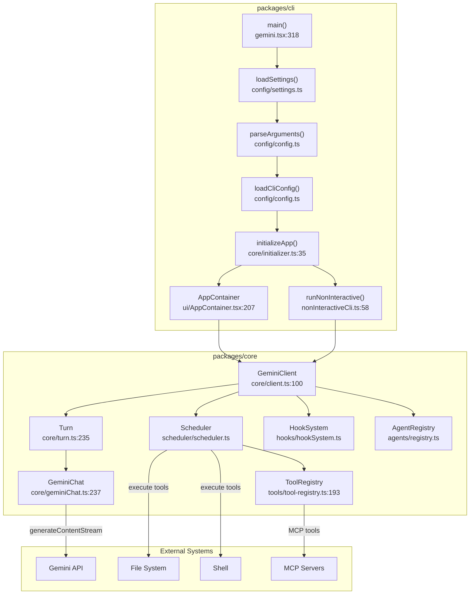

---

## 1. CLI Startup & Initialization

The entry point is `main()` in `packages/cli/src/gemini.tsx:318`. It
orchestrates the entire startup sequence.

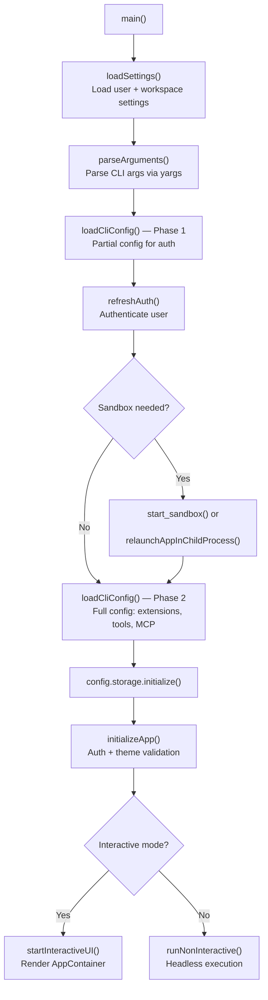

### Key Functions

#### `main()` — `packages/cli/src/gemini.tsx:318`

The top-level entry point. Sequentially:

1. `loadSettings()` — Loads user/workspace settings from disk
2. `parseArguments(settings)` — Parses CLI args (yargs)
3. `loadCliConfig()` (Phase 1) — Partial config for pre-sandbox auth
4. `partialConfig.refreshAuth()` — Runs authentication flow
5. `loadSandboxConfig()` — Checks if sandbox/relaunch is needed
6. `loadCliConfig()` (Phase 2) — Full config with extensions, tools, MCP
7. `initializeApp(config, settings)` — Final auth + theme validation
8. Routes to `startInteractiveUI()` or `runNonInteractive()`

#### `initializeApp()` — `packages/cli/src/core/initializer.ts:35`

```typescript
async function initializeApp(
  config: Config,
  settings: LoadedSettings,
): Promise<InitializationResult>
```

Performs final authentication via `performInitialAuth()`, validates theme
settings, and optionally connects to an IDE client. Returns an
`InitializationResult` containing `authError`, `themeError`, and
`shouldOpenAuthDialog`.

#### `AppContainer` — `packages/cli/src/ui/AppContainer.tsx:207`

The root React component for interactive mode. Sets up:

- UI state (processing, auth, model, quota, shell mode)
- Context providers (UIState, UIActions, Config, App, ToolActions, ShellFocus)
- `useGeminiStream` hook for streaming Gemini responses
- `useTextBuffer` for user input handling
- `useSessionResume` for checkpoint restoration

#### `runNonInteractive()` — `packages/cli/src/nonInteractiveCli.ts:58`

```typescript
async function runNonInteractive(params: RunNonInteractiveParams): Promise<void>
```

Headless execution flow:

1. Sets up console capture and stdin cancellation (Ctrl+C)
2. Processes `@include` commands and slash commands
3. Main loop: calls `geminiClient.sendMessageStream()`, iterates events
4. Handles `Content`, `ToolCallRequest`, `LoopDetected`, `Error` events
5. Dispatches tool calls via `scheduler.schedule()`
6. Loops until no pending tool calls, then outputs final result

---

## 2. Core Orchestration Engine

The core engine is built around three layered classes:
`GeminiClient` → `Turn` → `GeminiChat`.

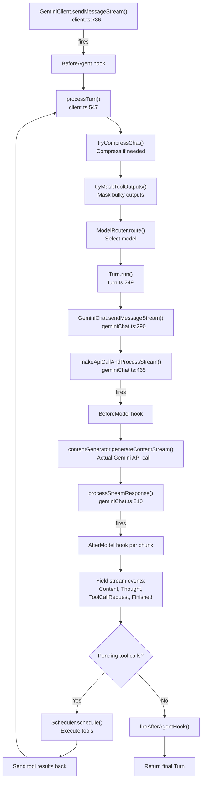

### Key Functions

#### `GeminiClient.sendMessageStream()` — `packages/core/src/core/client.ts:786`

```typescript
async *sendMessageStream(
  request: PartListUnion,
  signal: AbortSignal,
  prompt_id: string,
  turns: number = 100,
): AsyncGenerator<ServerGeminiStreamEvent, Turn>
```

Top-level entry for sending a user message. Fires `BeforeAgent` hook, then loops
up to `MAX_TURNS` (100) calling `processTurn()`. After all turns complete, fires
`AfterAgent` hook and returns the final `Turn`.

#### `GeminiClient.processTurn()` — `packages/core/src/core/client.ts:547`

A single conversation turn. Steps:

1. Check session turn limit
2. Compress chat history if over threshold
3. Mask bulky tool outputs
4. Estimate request token count
5. Route to model (sticky or fresh routing decision)
6. Call `turn.run()` to get streamed events
7. Check for invalid streams and retry
8. Check next speaker (model may request another turn)

#### `Turn.run()` — `packages/core/src/core/turn.ts:249`

```typescript
async *run(
  modelConfigKey: ModelConfigKey,
  req: PartListUnion,
  signal: AbortSignal,
): AsyncGenerator<ServerGeminiStreamEvent>
```

Calls `chat.sendMessageStream()` and processes chunks. For each chunk it yields
typed events: `Content`, `Thought`, `ToolCallRequest`, `Citation`, `Finished`,
`Error`. Function calls from the model are converted into
`ToolCallRequestInfo` objects via `handlePendingFunctionCall()`.

---

## 3. Gemini API Communication

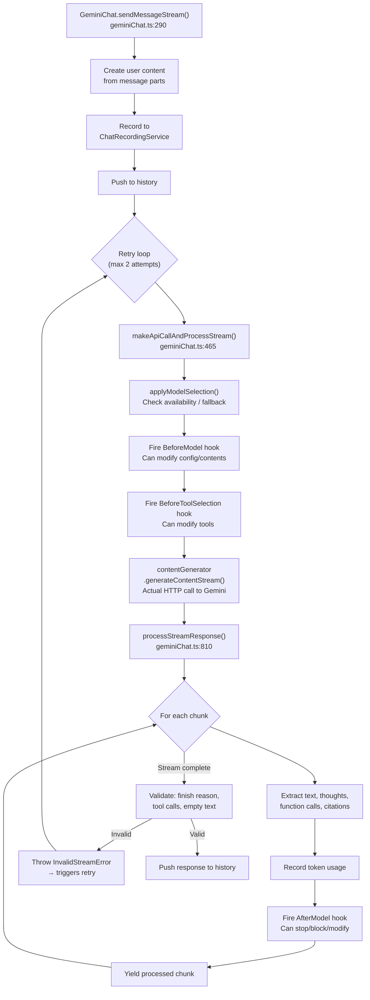

### Key Functions

#### `GeminiChat.sendMessageStream()` — `packages/core/src/core/geminiChat.ts:290`

```typescript
async sendMessageStream(
  modelConfigKey: ModelConfigKey,
  message: PartListUnion,
  prompt_id: string,
  signal: AbortSignal,
): Promise<AsyncGenerator<StreamEvent>>
```

Adds the user message to history, then enters a retry loop (max 2 attempts)
calling `makeApiCallAndProcessStream()`. Handles `InvalidStreamError` with
backoff retry. Returns an async generator of `StreamEvent` chunks.

#### `GeminiChat.makeApiCallAndProcessStream()` — `packages/core/src/core/geminiChat.ts:465`

Prepares the request with model availability fallback, fires `BeforeModel` and
`BeforeToolSelection` hooks, then calls
`contentGenerator.generateContentStream()`. Wraps everything in
`retryWithBackoff()` to handle 429 rate limits with automatic model fallback.

#### `GeminiChat.processStreamResponse()` — `packages/core/src/core/geminiChat.ts:810`

Processes streamed chunks from the API. For each chunk: extracts text, thoughts,
function calls, and citations. Records token usage. Fires `AfterModel` hook
(which can stop/block/modify). Validates the complete stream after iteration
(checks for finish reason, malformed function calls, empty text).

---

## 4. Tool System

### Tool Definition & Registration

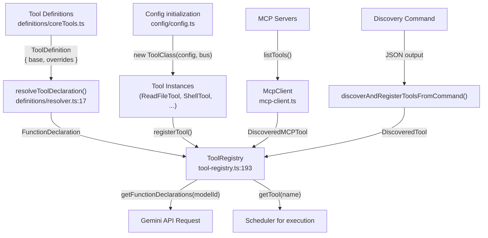

### Tool Definition Format

Each tool is defined in `packages/core/src/tools/definitions/coreTools.ts`:

```typescript
interface ToolDefinition {
  base: FunctionDeclaration;      // Name, description, parameters schema
  overrides?: (modelId: string)   // Model-specific customization
    => Partial<FunctionDeclaration> | undefined;
}
```

`resolveToolDeclaration()` (`definitions/resolver.ts:17`) merges model-specific
overrides with the base declaration.

### Tool Class Hierarchy

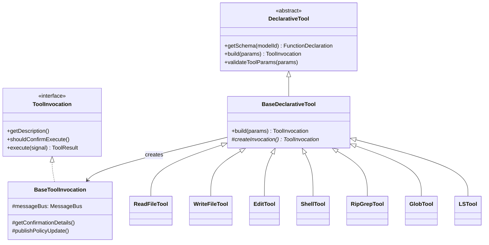

All tools follow the same pattern:

1. Extend `BaseDeclarativeTool`
2. Define parameters schema
3. Implement `createInvocation()` — returns a `BaseToolInvocation` subclass
4. The invocation's `execute()` does the actual work

### Built-in Tool Registration Order

In `packages/core/src/config/config.ts`, tools are registered:

| Priority | Category | Tools |
|----------|----------|-------|
| 0 | Read | `LSTool`, `ReadFileTool` |
| 0 | Search | `RipGrepTool` (or `GrepTool` fallback), `GlobTool` |
| 0 | Plan | `ActivateSkillTool` |
| 0 | Edit | `EditTool`, `WriteFileTool` |
| 0 | Fetch | `WebFetchTool` |
| 0 | Execute | `ShellTool` |
| 0 | Communicate | `MemoryTool`, `WebSearchTool`, `AskUserTool` |
| 0 | Plan Mode | `WriteTodosTool`, `ExitPlanModeTool`, `EnterPlanModeTool` |
| 1 | Discovered | Tools from discovery command |
| 2 | MCP | Tools from MCP servers |

### Key Tool Implementations

#### `ReadFileTool` — `packages/core/src/tools/read-file.ts`

- **Params:** `{ file_path, offset?, limit? }`
- Validates path access, reads content via `processSingleFileContent()`
- Handles text, images (PNG/JPG/GIF/WEBP/SVG/BMP), audio, and PDF
- Returns truncation info for large files

#### `WriteFileTool` — `packages/core/src/tools/write-file.ts`

- **Params:** `{ file_path, content, modified_by_user?, ai_proposed_content? }`
- Generates unified diff, detects/preserves line endings
- Integrates with IDE client for visual confirmation
- Calls `ensureCorrectFileContent()` for consistency

#### `EditTool` — `packages/core/src/tools/edit.ts`

- **Params:** `{ file_path, old_string, new_string, expected_replacements? }`
- `calculateExactReplacement()` — attempts literal match first
- `calculateFlexibleReplacement()` — fuzzy fallback if exact match fails
- LLM-based fallback repair via `FixLLMEditWithInstruction` if both fail
- Tracks modifications via SHA256 hash

#### `ShellTool` — `packages/core/src/tools/shell.ts`

- **Params:** `{ command, description?, dir_path?, is_background? }`
- Platform-specific: `powershell.exe` (Windows) or `bash -c` (Unix)
- Background process support, output streaming, process group management
- Combined stdout/stderr capture with exit code reporting

#### `RipGrepTool` — `packages/core/src/tools/ripGrep.ts`

- **Params:** `{ pattern, dir_path?, include?, context, max_matches_per_file, ... }`
- Auto-downloads ripgrep binary if unavailable
- Uses `execStreaming()` for efficient command execution
- Respects `.gitignore` patterns, supports context lines

---

## 5. Tool Execution & Confirmation Flow

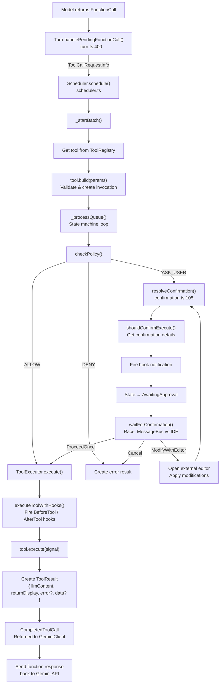

### State Machine

Each tool call transitions through these states:

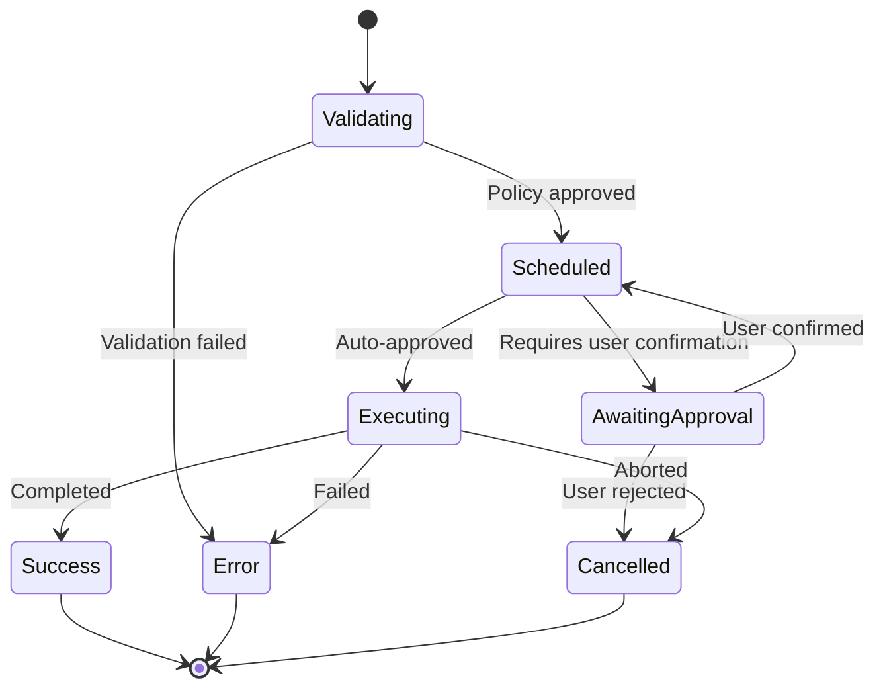

### Key Functions

#### `Scheduler.schedule()` — `packages/core/src/scheduler/scheduler.ts`

```typescript
async schedule(
  request: ToolCallRequestInfo | ToolCallRequestInfo[],
  signal: AbortSignal,
): Promise<CompletedToolCall[]>
```

Queues tool calls for execution. If already processing, enqueues for next batch.
Otherwise calls `_startBatch()` → `_processQueue()`.

#### `resolveConfirmation()` — `packages/core/src/scheduler/confirmation.ts:108`

Interactive confirmation loop. Gets confirmation details from the tool, fires
hook notification, sets state to `AwaitingApproval`, waits for user response via
`waitForConfirmation()`. Supports `ModifyWithEditor` (opens Vim etc. and loops
back) and inline IDE modifications.

#### `ToolExecutor.execute()` — `packages/core/src/scheduler/tool-executor.ts`

Executes a validated tool call by calling `executeToolWithHooks()`, which fires
`BeforeTool`/`AfterTool` hooks around the actual `tool.execute()` call. Returns
`CompletedToolCall` with success/error/cancelled result.

#### `SchedulerStateManager.updateStatus()` — `packages/core/src/scheduler/state-manager.ts`

Manages state transitions and publishes changes via `MessageBus`. The
`TOOL_CALLS_UPDATE` event notifies the UI of state changes for live rendering.

### Confirmation Outcomes

| Outcome | Effect |
|---------|--------|
| `ProceedOnce` | Execute this one time |
| `ProceedAlways` | Execute and auto-approve future calls of this tool |
| `ProceedAlwaysAndSave` | Auto-approve and persist to policy |
| `ProceedAlwaysServer` | (MCP) Trust entire server |
| `ProceedAlwaysTool` | (MCP) Trust specific MCP tool |
| `Cancel` | Reject execution |
| `ModifyWithEditor` | Open external editor, then re-confirm |

---

## 6. Agent System

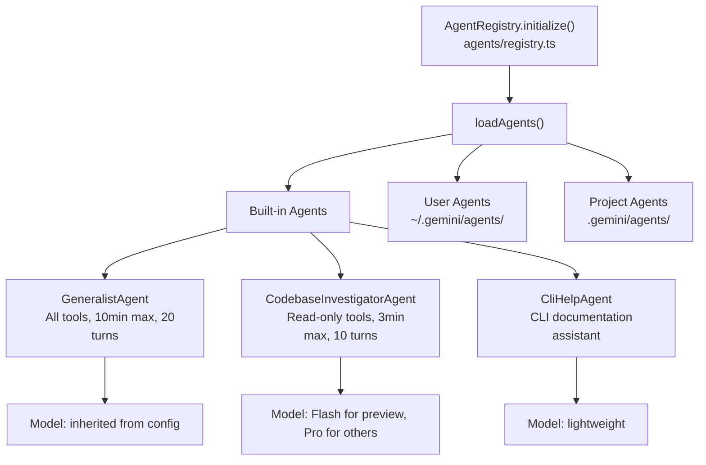

### Agent Definitions

Agents are defined as `LocalAgentDefinition<Schema>` objects in
`packages/core/src/agents/`.

| Agent | File | Tools | Max Time | Max Turns |
|-------|------|-------|----------|-----------|
| **Generalist** | `generalist-agent.ts` | All tools | 10 min | 20 |
| **Codebase Investigator** | `codebase-investigator.ts` | Read-only (ls, read_file, glob, grep, web_fetch) | 3 min | 10 |
| **CLI Help** | `cli-help-agent.ts` | Documentation access | - | - |

The `AgentRegistry` discovers agents from built-in directories plus
user/project-level agent directories. Each agent has its own system prompt, tool
set, model selection, and output schema.

---

## 7. MCP Integration

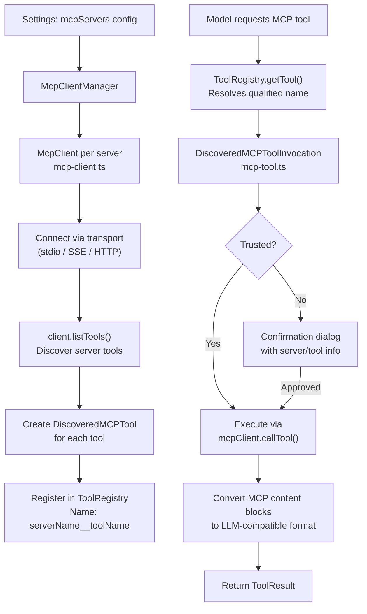

### Key Classes

#### `McpClient` — `packages/core/src/tools/mcp-client.ts`

Each MCP server gets its own `McpClient` instance with:

- **Status tracking:** `DISCONNECTED` → `CONNECTING` → `CONNECTED`
- **Transport:** Stdio, SSE, or StreamableHTTP
- **Tool discovery:** `listTools()` → register as `DiscoveredMCPTool`
- **OAuth support** via `MCPOAuthProvider`

#### `DiscoveredMCPToolInvocation` — `packages/core/src/tools/mcp-tool.ts`

Wraps MCP server tools with the same `ToolInvocation` interface as built-in
tools. Adds MCP-specific confirmation options (trust server, trust tool).
Converts MCP content blocks (text, media, resource) to LLM-compatible format.

---

## 8. Hook System

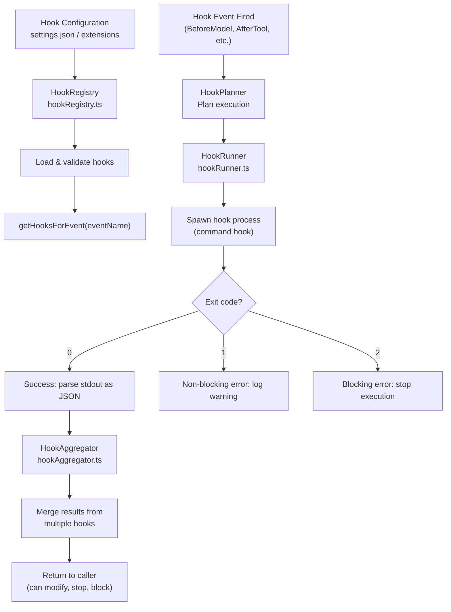

### Hook Events

| Event | Trigger Point | Capabilities |
|-------|--------------|-------------|
| `SessionStart` | App initialization | Modify session setup |
| `BeforeAgent` | Before `sendMessageStream()` | Stop/block agent, add context |
| `AfterAgent` | After all turns complete | Post-process response, clear context |
| `BeforeModel` | Before each API call | Modify config/contents, stop/block |
| `AfterModel` | After each response chunk | Modify response, stop/block |
| `BeforeToolSelection` | Before sending tools to API | Override tool list/config |
| `BeforeTool` | Before tool execution | Modify/block tool call |
| `AfterTool` | After tool execution | Process tool result |
| `Notification` | Tool confirmation pending | Notify external systems |
| `PreCompress` | Before chat compression | Save important context |
| `SessionEnd` | Session termination | Cleanup actions |

### Hook Configuration

Hooks are defined in `settings.json` as shell commands:

```json
{
  "hooks": {
    "BeforeTool": [{
      "matcher": "run_shell_command",
      "hooks": [{
        "type": "command",
        "command": "node validate-command.js"
      }]
    }]
  }
}
```

Configuration sources (highest to lowest precedence): Project → User → System →
Extensions.

**Security:** Project hooks are blocked in untrusted folders. Default timeout is
60 seconds.

---

## 9. Configuration System

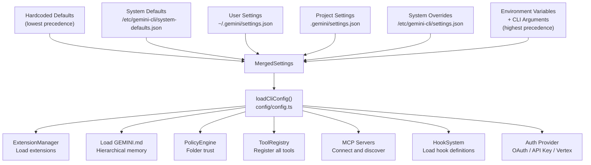

### Two-Phase Loading

Configuration is loaded twice:

1. **Phase 1 (pre-sandbox):** Partial config sufficient for authentication and
   admin settings decisions
2. **Phase 2 (post-sandbox):** Full config with extensions, tools, MCP servers,
   and policy engine

### Key Settings Categories

| Category | Key Options |
|----------|-----------|
| `general` | `vimMode`, `preferredEditor`, `defaultApprovalMode` (default/auto_edit/plan) |
| `ui` | `theme`, `autoThemeSwitching`, `inlineThinkingMode` |
| `model` | `name`, `maxSessionTurns`, `compressionThreshold` |
| `tools` | `sandbox` (true/false/docker/podman), shell config, allowed/excluded tools |
| `mcp` / `mcpServers` | MCP server command configuration per server |
| `security` | `folderTrust`, `envVarRedaction`, auth type enforcement |
| `hooks` | `BeforeTool`, `AfterTool`, `BeforeModel`, etc. lifecycle hooks |
| `experimental` | `agents`, `extensionManagement`, `jitContext`, plan mode |

### Key Environment Variables

```
GEMINI_API_KEY, GEMINI_MODEL, GOOGLE_API_KEY,
GOOGLE_CLOUD_PROJECT, GOOGLE_APPLICATION_CREDENTIALS,
GEMINI_CLI_HOME, GEMINI_SANDBOX, DEBUG
```

---

## Key File Reference

| Component | File | Key Symbols |
|-----------|------|-------------|
| CLI Entry | `packages/cli/src/gemini.tsx:318` | `main()` |
| Interactive UI | `packages/cli/src/ui/AppContainer.tsx:207` | `AppContainer` |
| Headless Mode | `packages/cli/src/nonInteractiveCli.ts:58` | `runNonInteractive()` |
| App Init | `packages/cli/src/core/initializer.ts:35` | `initializeApp()` |
| Config Load | `packages/cli/src/config/config.ts` | `loadCliConfig()` |
| Settings | `packages/cli/src/config/settings.ts` | `loadSettings()` |
| Auth | `packages/cli/src/config/auth.ts` | `validateAuthMethod()` |
| GeminiClient | `packages/core/src/core/client.ts:100` | `GeminiClient`, `sendMessageStream()`, `processTurn()` |
| Turn | `packages/core/src/core/turn.ts:235` | `Turn`, `run()`, `handlePendingFunctionCall()` |
| GeminiChat | `packages/core/src/core/geminiChat.ts:237` | `GeminiChat`, `sendMessageStream()`, `makeApiCallAndProcessStream()`, `processStreamResponse()` |
| Tool Definitions | `packages/core/src/tools/definitions/coreTools.ts` | `READ_FILE_DEFINITION`, `SHELL_DEFINITION`, etc. |
| Tool Resolver | `packages/core/src/tools/definitions/resolver.ts:17` | `resolveToolDeclaration()` |
| Tool Registry | `packages/core/src/tools/tool-registry.ts:193` | `ToolRegistry`, `registerTool()`, `getTool()` |
| Tool Base | `packages/core/src/tools/tools.ts` | `DeclarativeTool`, `BaseDeclarativeTool`, `BaseToolInvocation` |
| Scheduler | `packages/core/src/scheduler/scheduler.ts` | `Scheduler`, `schedule()`, `_processQueue()` |
| Confirmation | `packages/core/src/scheduler/confirmation.ts:108` | `resolveConfirmation()`, `waitForConfirmation()` |
| Tool Executor | `packages/core/src/scheduler/tool-executor.ts` | `ToolExecutor.execute()` |
| State Manager | `packages/core/src/scheduler/state-manager.ts` | `SchedulerStateManager`, `updateStatus()` |
| Agent Registry | `packages/core/src/agents/registry.ts` | `AgentRegistry`, `loadAgents()` |
| Hook System | `packages/core/src/hooks/hookSystem.ts` | `HookSystem` |
| Hook Registry | `packages/core/src/hooks/hookRegistry.ts` | `HookRegistry`, `getHooksForEvent()` |
| Hook Runner | `packages/core/src/hooks/hookRunner.ts` | `HookRunner`, `executeHook()` |
| MCP Client | `packages/core/src/tools/mcp-client.ts` | `McpClient`, `connectServer()`, `callTool()` |
| MCP Tool | `packages/core/src/tools/mcp-tool.ts` | `DiscoveredMCPToolInvocation` |
| ReadFile | `packages/core/src/tools/read-file.ts` | `ReadFileTool` |
| WriteFile | `packages/core/src/tools/write-file.ts` | `WriteFileTool` |
| Edit | `packages/core/src/tools/edit.ts` | `EditTool` |
| Shell | `packages/core/src/tools/shell.ts` | `ShellTool` |
| RipGrep | `packages/core/src/tools/ripGrep.ts` | `RipGrepTool` |
| Glob | `packages/core/src/tools/glob.ts` | `GlobTool` |
