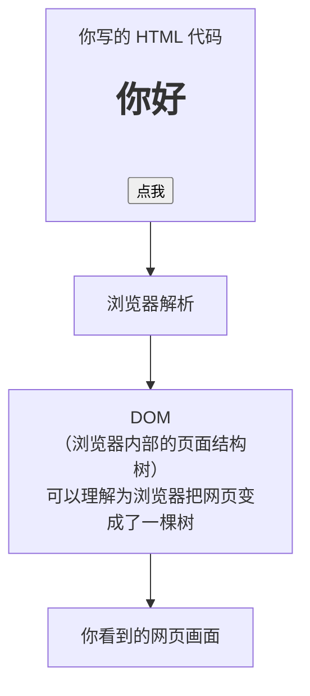
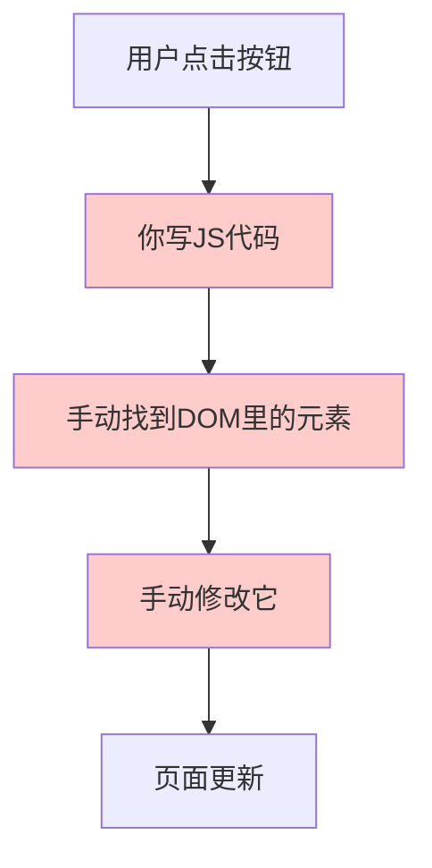
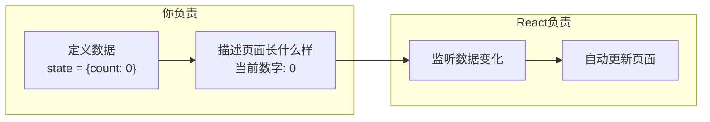
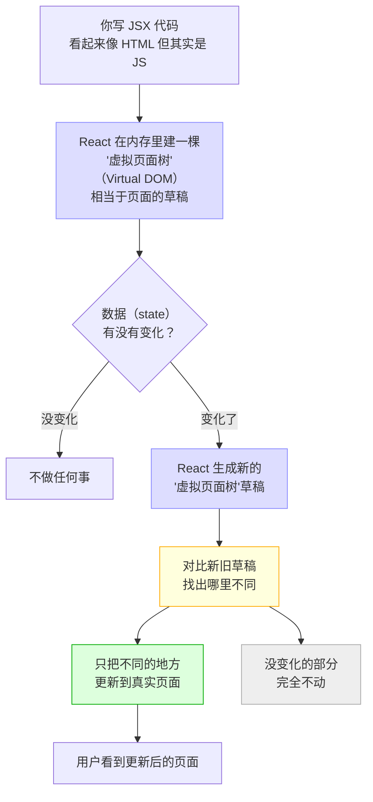
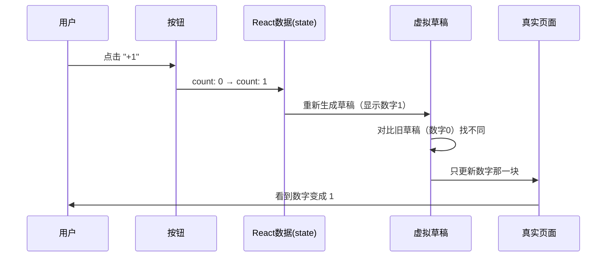
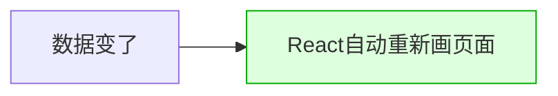
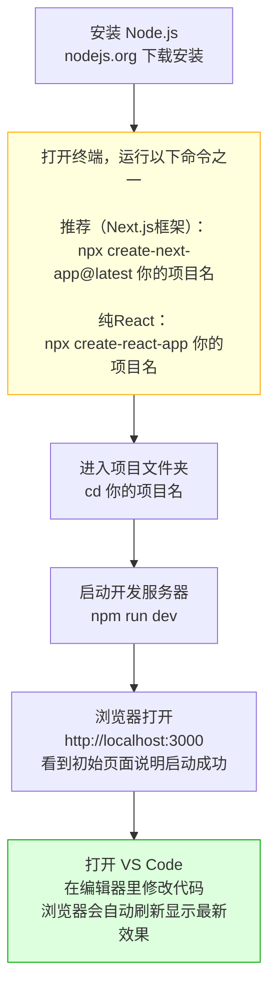
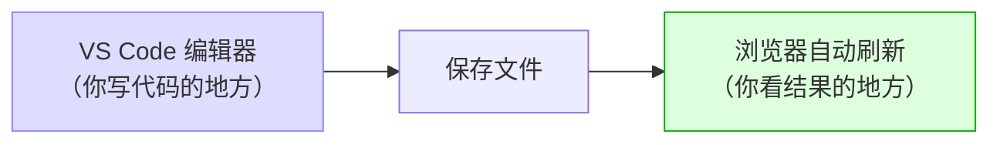

# React 学习笔记 —— 从零开始

---

## DOM 是什么？

**DOM = Document Object Model（文档对象模型）**

简单记：浏览器把你的网页（Document）变成一个可以用代码操作的树形结构（Object Model）。



---

## 第一步：理解网页的本质

每一个网页，背后都是 HTML 代码。浏览器读取这段代码，把它变成你看到的画面。

---

## 第二步：没有 React 时的痛点



当页面越来越复杂，你要手动追踪几十上百个地方的变化，**非常容易出错且难以维护**。

---

## 第三步：React 的核心思想

React 说：**你只管描述"数据变了之后页面长什么样"，DOM 的事我来帮你做。**



---

## 第四步：React 完整工作流程



---

## 第五步：用「计数器」具体举例



---

## 一句话总结



**你只需要关心数据，页面的更新 React 全包了。**

---

## 怎么把 React 引入到项目中

### 第一步：安装 Node.js

去 [nodejs.org](https://nodejs.org) 下载安装。

### 第二步：用命令创建项目



### 在哪里写代码？



> 你**不是**在浏览器里写代码，浏览器只是显示结果。
> 代码写在编辑器（如 VS Code）里，保存后浏览器自动更新。

---

## 本项目文件结构说明

```
happy_birthday/
├── learning_start.md      ← 你现在看的这个文件（React学习笔记）
├── package.json           ← 项目依赖配置（告诉npm需要装哪些库）
├── vite.config.js         ← 项目构建工具配置
├── index.html             ← HTML入口（浏览器读取的起点）
└── src/
    ├── main.jsx           ← React程序入口（把React挂载到页面上）
    ├── App.jsx            ← 根组件（最外层的组件）
    ├── HappyBirthday.jsx  ← 生日庆祝页面组件（主要逻辑在这里）
    └── HappyBirthday.css  ← 样式文件（页面的外观）
```
